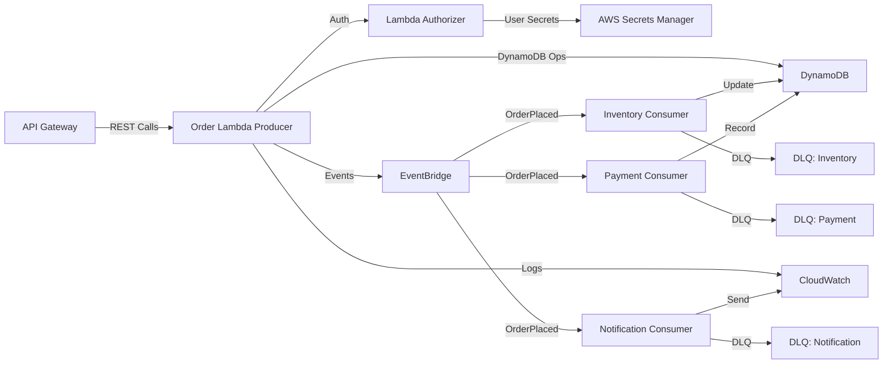
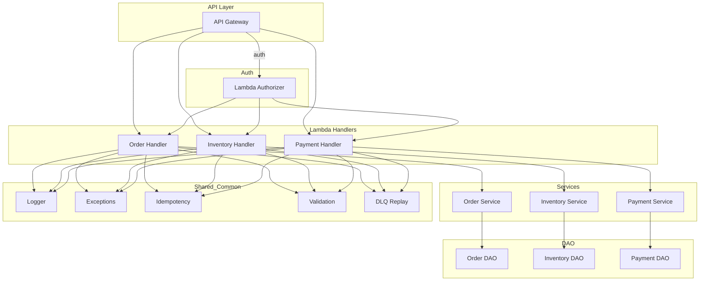
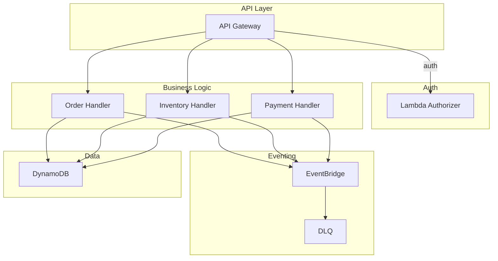
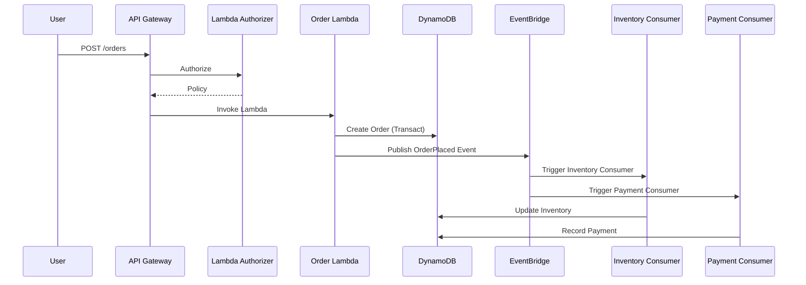

# Order Processing System for a Multi-Vendor E-Commerce Platform

## Overview
This project is a serverless, event-driven order processing system for a multi-vendor e-commerce platform, built on AWS Lambda, API Gateway, EventBridge, and DynamoDB. It supports:
- Order placement and management
- Vendor inventory updates
- Payment processing
- Notifications
- Centralized logging, error handling, and idempotency
- DLQ and replay for failed events
- Role-based and username-password authentication via a custom Lambda Authorizer


## Architecture
- **API Gateway**: Exposes REST endpoints for orders, inventory, and payments.
- **Lambda Functions**: Modular handlers for each business domain (order, inventory, payment, notification).
- **EventBridge**: Publishes and routes business events (e.g., OrderPlaced).
- **DynamoDB**: Stores orders, inventory, payments, and idempotency keys.
- **DLQ**: Handles failed events for replay.
- **AWS Secrets Manager**: Securely stores user credentials and roles for Lambda authorizer.

---

## System Diagrams

### 1. High-Level Architecture Diagram



*Note: Text-based AWS resource names are used for maximum compatibility. For official AWS icons, see https://aws.amazon.com/architecture/icons/*

### 1a. Low Level Architectural Diagram



*This diagram shows the flow from API Gateway through Lambda handlers, services, DAOs, and shared/common utilities, emphasizing modularity and separation of concerns.*

### 2. Functional Block Diagram



### 3. Sequence Diagram: Order Placement



---

## Setup & Deployment
1. **Clone the repository**
2. **Install dependencies**
   ```bash
   pip install -r requirements.txt
   ```
3. **Set environment variables** for each Lambda:
   - `ORDERS_TABLE`, `INVENTORY_TABLE`, `PAYMENTS_TABLE`, `IDEMPOTENCY_TABLE`
   - `EVENT_BUS_NAME`
   - `AUTH_TOKEN` (for demo Bearer token)
   - `AWS_REGION` (for Secrets Manager region)
   - User credentials and roles are now securely managed in AWS Secrets Manager (see below).
4. **Deploy Lambdas and API Gateway**
   - Use AWS Console, SAM, or Serverless Framework
   - Attach the custom authorizer to protected endpoints
5. **Configure EventBridge rules** to route `OrderPlaced` events to consumers
6. **Set up DLQs** for all consumers and wire replay handlers

## API Endpoints & Sample Requests

### Order Placement
- **POST** `/orders`
- **Authorization**: `Basic` (admin:password)
- **Request**
  ```json
  {
    "customerId": "cust123",
    "items": [
      {"vendorId": "v1", "productId": "p1", "quantity": 2}
    ]
  }
  ```
- **Response**
  ```json
  {"success": true, "orderId": "..."}
  ```

### Inventory Update
- **POST** `/inventory`
- **Authorization**: `Bearer demo-token`
- **Request**
  ```json
  {"vendorId": "v1", "productId": "p1", "quantity": 10}
  ```
- **Response**
  ```json
  {"success": true, "vendorId": "v1", "productId": "p1"}
  ```

### Payment Processing
- **POST** `/payments`
- **Authorization**: `Bearer demo-token`
- **Request**
  ```json
  {"orderId": "order123", "amount": 100, "paymentMethod": "credit_card"}
  ```
- **Response**
  ```json
  {"success": true, "orderId": "order123"}
  ```

## Error Response Format
```json
{
  "errorCode": "BAD_REQUEST",
  "errorMessage": "Bad request",
  "timestamp": "...",
  "recommendedData": {"details": "..."}
}
```

## Swagger/OpenAPI
- [Swagger Editor](https://editor.swagger.io/)
- Example OpenAPI snippet:
```yaml
openapi: 3.0.1
info:
  title: Order Processing API
  version: 1.0.0
paths:
  /orders:
    post:
      summary: Place an order
      requestBody:
        required: true
        content:
          application/json:
            schema:
              $ref: '#/components/schemas/OrderRequest'
      responses:
        '201':
          description: Order placed
          content:
            application/json:
              schema:
                $ref: '#/components/schemas/OrderResponse'
      security:
        - basicAuth: []
components:
  schemas:
    OrderRequest:
      type: object
      properties:
        customerId:
          type: string
        items:
          type: array
          items:
            type: object
            properties:
              vendorId:
                type: string
              productId:
                type: string
              quantity:
                type: integer
    OrderResponse:
      type: object
      properties:
        success:
          type: boolean
        orderId:
          type: string
  securitySchemes:
    basicAuth:
      type: http
      scheme: basic
```

## Recommendations
- Use AWS SAM or Serverless Framework for repeatable deployments.
- Set up CloudWatch Alarms for error monitoring.
- Use AWS X-Ray for distributed tracing.
- Regularly test DLQ and replay logic.
- Add event versioning for future-proofing.
- Store user credentials and roles in AWS Secrets Manager as JSON objects (e.g., `{ "password_hash": "...", "role": "admin" }`).
- Never store or compare plain-text passwords; always use salted hashes.

---
For more details, see the code and comments in each module. Contributions and improvements are welcome!


